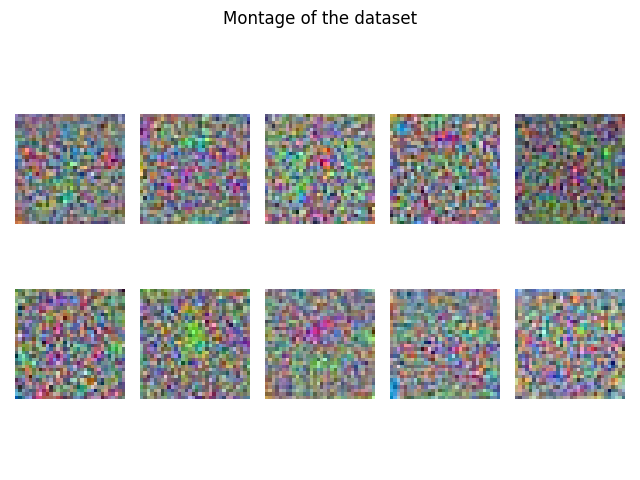
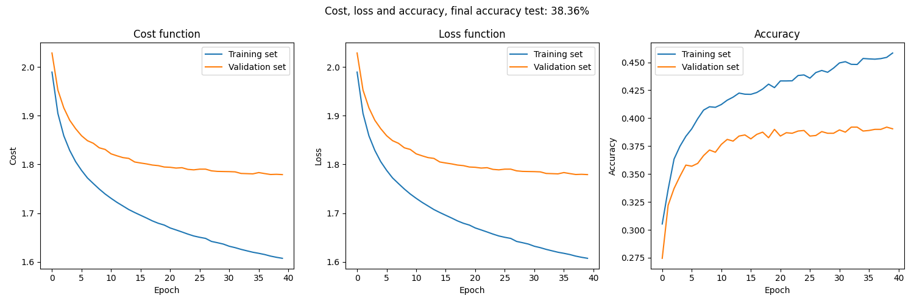
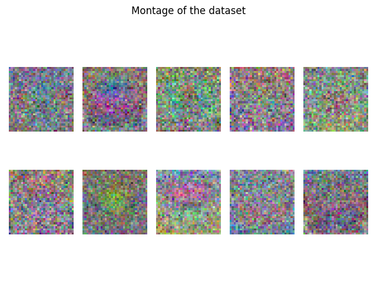
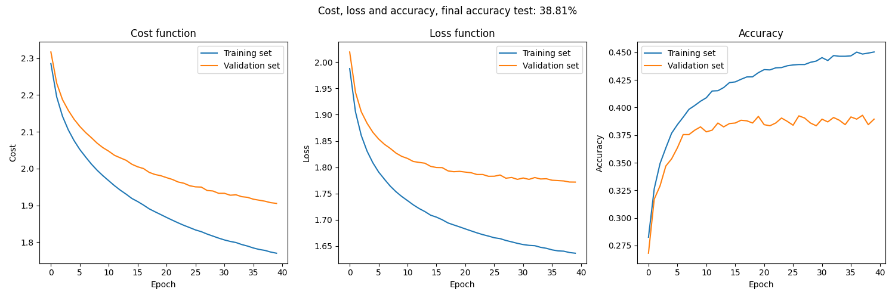
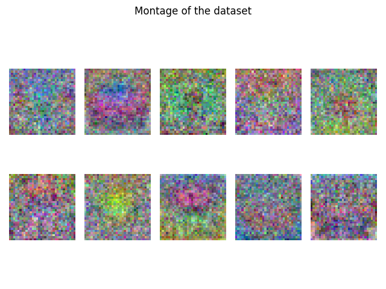

# Assignment 1 - DD2424 - One Layer Network

> Tristan PERROT

## Exercise 1

The goal of this exercise is to try to create a one-layer network to classify images. This is a sample of what pictures look like and their labels:


After pre-processing our data, we were asked to implement function to prepare the training of a one layer neural network. After implementing this function in the file `Assignment1.py`. We were asked to test with given gradient checking function.

With a **mini batch** size of 20 and a **lambda** of 0, I obtained the following results:

```output
Relative error grad_W: 0.007670216306639771
Relative error grad_b: 6.913182419900119e-06
Relative error grad_W_slow: 4.8046925072640953e-05
Relative error grad_b_slow: 1.0773036776280925e-08
```

Also with **dimension** reduced to 2 and the same parameters, I obtained the following results:

```output
Relative error grad_W: 6.523845438776908e-06
Relative error grad_b: 0.0008241041050076656
Relative error grad_W_slow: 5.8520390237122694e-08
Relative error grad_b_slow: 3.96584525426006e-06
```

The relative error is quite low and the two first lines is bigger because the gradient computation is not the most accurate, it uses the *finite difference method*. The two last lines are the most accurate because they use the *centered difference formula*.

After that we were asked to train and test the network on the CIFAR-10 dataset. I obtained the following results:

With `lambda=0, n_epochs=40, n_batch=100, eta=.1`:


> Final test accuracy: 28.1%

Here the learning rate is way too high, the cost is not decreasing and the accuracy is not increasing. We can see that the weights are not well distributed.

With `lambda=0, n_epochs=40, n_batch=100, eta=.001`:


> Final test accuracy: 38.53%

Here we see the **benefit of a lower learning rate**. The cost is decreasing and the accuracy is increasing. The weights are more distributed and we can see some patterns. We also have a better accuracy on the test set.

With `lambda=.1, n_epochs=40, n_batch=100, eta=.001`:


> Final test accuracy: 38.9%

Here we see that the **regularization** is helping a bit. The cost is a bit higher but the accuracy is a bit higher too, it helps to generalize the model, we can see that on the validation set. Moreover, the weights are more distributed and we can see some patterns.

With `lambda=1, n_epochs=40, n_batch=100, eta=.001`:


> Final test accuracy: 37.28%

Now the test accuracy is decreasing because the **regularization** is too high. The cost is higher and the training and validation costs are almost the same. The weights are more distributed but the patterns are too clear and the model is not able to generalize.

To conclude, the best model is the one with `lambda=0, n_epochs=40, n_batch=100, eta=.001`.
The importance of the **learning rate** is crucial, if it is too high the model will not be able to learn, if it is too low the model will take too much time to learn or never learn.
The **regularization** is also important, it helps to generalize the model and to avoid overfitting. If the regularization is too high, the model will not be able to learn, if it is too low the model will maybe overfit. The regularization make also the training and validation costs closer.
