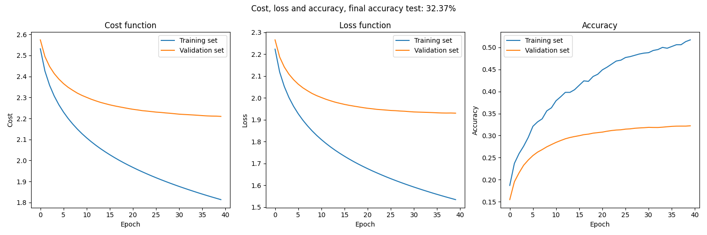
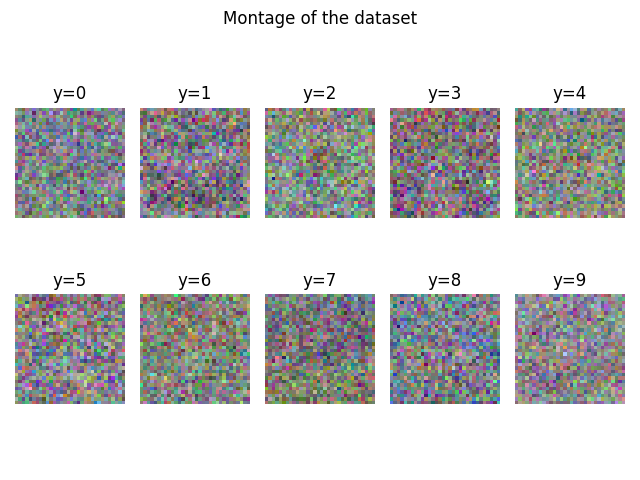
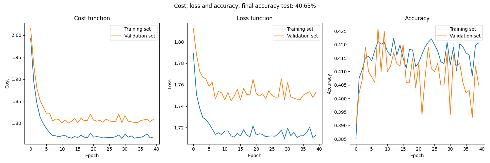
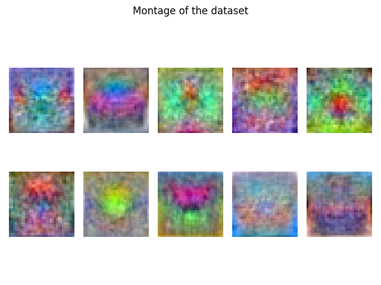
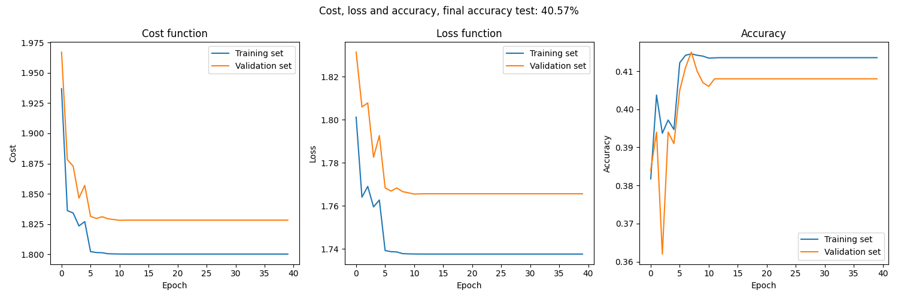
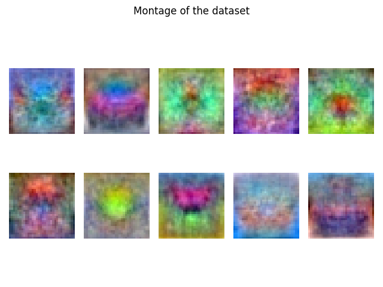
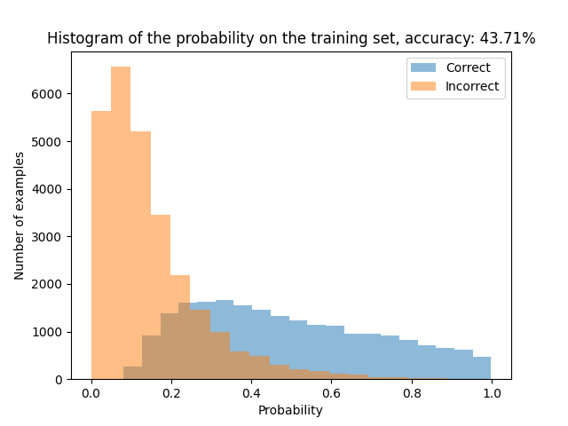
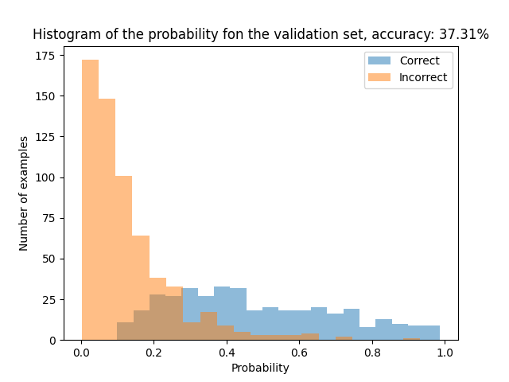
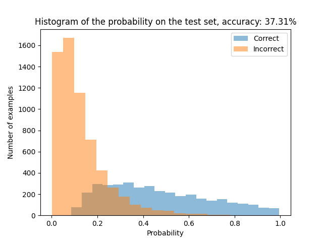

# Assignment 1 Bonus - DD2424 - One Layer Network

> Tristan PERROT

## Exercise 2 - Optional for Bonus Points

### Improve performance of the network

The goal now is to improve the model by adding some techniques.

At first, I retrieve all the data and I normalize it after that I split it into a training, validation and test set. I also implement a grid search to see which parameters are the best for the model.
This is the best result I obtained:

- With old hyperparameters: `lambda=0.1, n_epochs=40, n_batch=100, eta=.001`

There we can already see a huge improvement compared to the previous model. The accuracy is now **2%** better than before. This is due to the fact that we have more data to train the model and therefore the model is more accurate. However, the model is a really simple model and I think the improvement would be better with a more complex model. However, we can see that on the accuracy graph, the curves are not smooth, certainly due to hyperparameters, which can be improved with the grid search.

- With best hyperparameters: `lambda=0.1, n_batch= 200, n_epochs= 40, eta= 0.005`

Now we can see the benefits of the grid search. Unfortunately, the accuracy is not better than the previous model. The hyperparameters are closed to the ones before. Moreover, the accuracy can may us thinking that the network is overfitting.

After that, I implement the **step decay** and I only used all of the data. I re used the best parameters but with an higher learning rate because it will be decayed. I obtained the following results:

- With `lambda=0.2, n_batch=200, n_epochs=40, eta= 0.01`

Unfortunately, the step decay is not helping so much. But the accuracy is not oscillating as much as before. The model is not overfitting but we could have a better accuracy by using a more complex model, more adapted to the problem. We see there the limits of a simple model.

## Train network - multiple binary cross-entropy losses

After that, I implement the **multiple binary cross-entropy losses** with **sigmoid** activation function on all the dataset.
$$
\begin{equation}
    \begin{split}
        p &= \sigma(s) \\
        &= \sigma(Wx + b) \\
        &= \frac{1}{1+e^{-s}}
    \end{split}
\end{equation}
$$
$$
\begin{equation}
    \begin{split}
        l_{multiple\ bce} &= -\frac{1}{K}\sum_{i=1}^{K} y_i \log(p_i) + (1-y_i) \log(1-p_i)
    \end{split}
\end{equation}
$$
$$
\begin{equation}
\frac{\partial p}{\partial s} = p(1-p)
\end{equation}
$$
$$
\begin{equation}
\begin{split}
\frac{\partial l_{multiple\ bce}}{\partial p} &= -\frac{1}{K} (\frac{y}{p} - \frac{1-y}{1-p}) \\
&= -\frac{1}{K} \left( \frac{y - p}{p(1-p)} \right)
\end{split}
\end{equation}
$$
$$
\begin{equation}
\begin{split}
\frac{\partial l_{multiple\ bce}}{\partial s} &= \frac{\partial l_{multiple\ bce}}{\partial p} \frac{\partial p}{\partial s} \\
&= -\frac{1}{K} \left( \frac{y - p}{p(1-p)} \right) p(1-p) \\
&= -\frac{1}{K} (y - p)
\end{split}
\end{equation}
$$

And therefore, the gradient of the loss with respect to the weights and the bias is:
$$
\begin{equation}
\begin{split}
\frac{\partial l_{multiple\ bce}}{\partial W} &= \frac{\partial l_{multiple\ bce}}{\partial s} \frac{\partial s}{\partial W} \\
&= -\frac{1}{K} (y - p) x^T
\end{split}
\end{equation}
$$
$$
\begin{equation}
\begin{split}
\frac{\partial l_{multiple\ bce}}{\partial b} &= \frac{\partial l_{multiple\ bce}}{\partial s} \frac{\partial s}{\partial b} \\
&= -\frac{1}{K}\sum_{i=1}^{K} (y_i - p_i) \\
\end{split}
\end{equation}
$$

And this is the result I obtained with the hyperparameters: `n_batch=200, n_epochs=50, eta=.001`:

Here we don't have an improvement because the test accuracy is **38.88%**. However, the model is not overfitting. The model is still not adapted to the problem. We need a more complex model to have a better accuracy.
