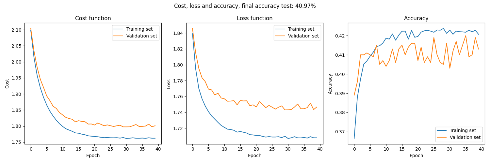
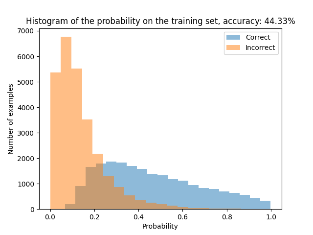

# Assignment 1 Bonus - DD2424 - One Layer Network

> Tristan PERROT

## Exercise 2 - Optional for Bonus Points

### Improve performance of the network

The goal now is to improve the model by adding some techniques.

At first, I retrieve all the data and I normalize it after that I split it into a training, validation and test set. I also implement a grid search to see which parameters are the best for the model.
This is the best result I obtained:

- With old hyperparameters: `lambda=0.1, n_epochs=40, n_batch=100, eta=.001`

- With best hyperparameters: `lambda=0.5, n_epochs=80, n_batch=100, eta=.001`

Unfortunately, we see here not much improvement by selecting all the data! Indeed, it's important to have in mind that we try to classify RGB images with a single layer network ! The capacity to memorize and well classify images for a single layer neural network is not enough. A more complex model is needed to have better results, like a convolutional neural network.
However, the grid search is a good way to find the best hyperparameters for the model, it's just a bit long to compute.

After that, I implement the **step decay** and I only used the one batch that we used before. I re used the best parameters but with more epochs to see if the step decay is helping. I obtained the following results:

- With `lambda=0.1, n_epochs=1000, n_batch=100, eta=.1`

Unfortunately, the step decay is not helping, the cost is not decreasing and the accuracy is not increasing compared to the best previous model.

## Train network - multiple binary cross-entropy losses

After that, I implement the **multiple binary cross-entropy losses** with **sigmoid** activation function.
$$
\sigma(s) = \frac{1}{1+e^{-s}} \\
l_{multiple\ bce} = -\frac{1}{K}\sum_{i=1}^{K} y_i \log(\hat{y}_i) + (1-y_i) \log(1-\hat{y}_i) \\
z = Wx + b \\
\hat{y} = \sigma(z) \\
$$
$$
\frac{\partial  l_{multiple\ bce}}{\partial W} = \frac{\partial  l_{bce}}{\partial \hat{y}} \frac{\partial \hat{y}}{\partial z} \frac{\partial z}{\partial W} \\
\frac{\partial  l_{multiple\ bce}}{\partial W} = \left( \frac{\hat{y} - y}{\hat{y}(1-\hat{y})} \right) \left( \hat{y}(1-\hat{y}) \right)x = (\hat{y} - y)x \\
\frac{\partial  l_{multiple\ bce}}{\partial b} = \frac{1}{K} \sum_{i=1}^{K} (\hat{y}_i - y_i)
$$

And this is the result I obtained with the hyperparameters: `lambda=0.1, n_epochs=50, n_batch=100, eta=.0001`:

Here we have not a huge improvement on the accuracy compared to the previous model. The model is not overfitting but we could have a better accuracy by using a more complex model, more adapted to the problem.
